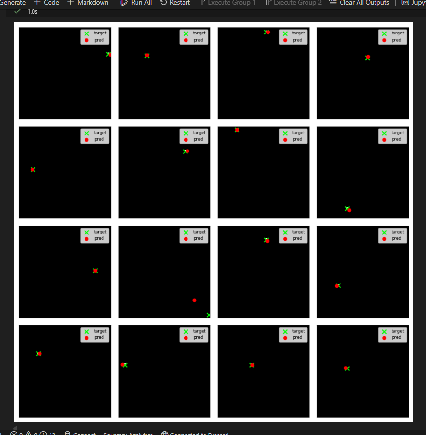
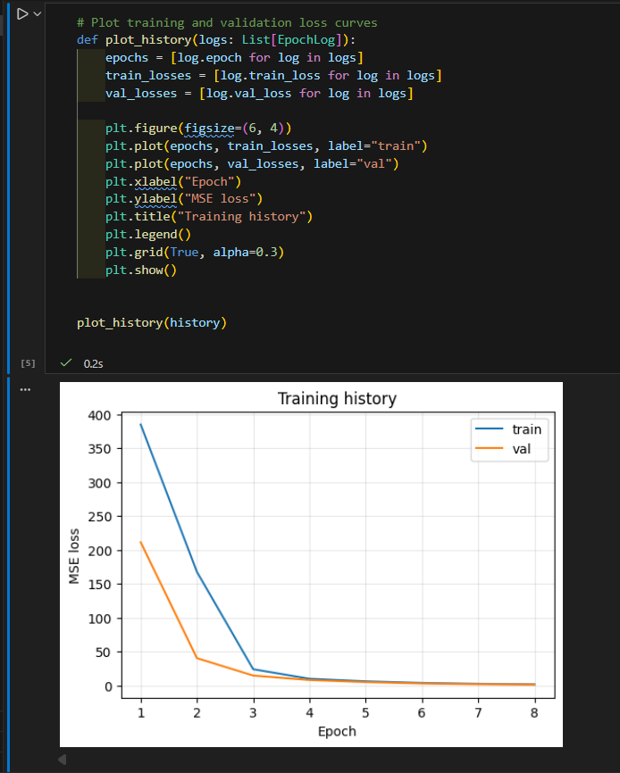
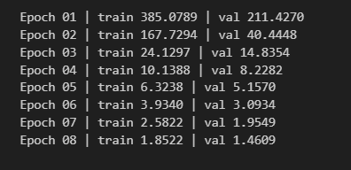

# Pixel Coordinate Predictor

Small, self-contained example that trains a CNN to predict the `(x, y)` position of the single bright pixel (value 255 → scaled to 1.0) in a 50×50 grayscale image.

## Setup

1. Python 3.10+ recommended.
2. Install deps:

```
pip install -r requirements.txt
```

## Run

Open the notebook and run top-to-bottom (CPU is fine):

```
jupyter notebook pixel_coordinate_predictor.ipynb
```

The notebook prints training logs, plots train/val loss, shows predicted vs. ground-truth coordinates, and reports MSE/MAE on the validation split.

## Dataset rationale

- Data is generated on the fly: one pixel is set to 1.0 at a random `(x, y)`, everything else is zero.
- This covers the full coordinate space uniformly without downloads.
- Targets are raw pixel indices (0–49 for both axes); we use a simple regression head with `MSELoss`.

## Project layout

- `pixel_coordinate_predictor.ipynb` — end-to-end code, training, visuals, notes.
- `requirements.txt` — minimal dependencies (PyTorch, plotting, notebook).

## Notes

- Increase `TOTAL_SAMPLES` or `EPOCHS` in the notebook for tighter convergence.
- Swap `MSELoss` for `SmoothL1Loss` if you prefer less sensitivity to outliers.

## Sample output




